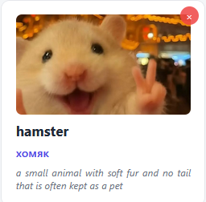

# My Flashcards Web Application

Built entirely with vanilla HTML5, CSS3, and JavaScript (ES6+), it runs directly in the browser with no server setup or external dependencies required.

---

## Key Features

* **Custom Flashcard Management**: Easily create, edit, and delete flashcards with custom words, translations, definitions, and images.
* **Flexible Image Upload**: Support for attaching images either directly from your local drive (stored via Base64) or through external image URLs.
* **Folder Organization**: Categorize cards into custom folders. Extra folders collapse cleanly under a toggle menu to maintain an organized sidebar.
* **Interactive Study Mode**: Practice vocabulary using a 3D flipping card viewer supporting three study modes:
  * Word -> Translation
  * Meaning -> Word
  * Photo -> Word
* **Cross-Device Synchronization**:
  * **Export / Import**: Save and load your data using local JSON files.
  * **GitHub Gist Sync**: Store and retrieve card collections across devices using a private GitHub Gist and Personal Access Token.
* **Multilingual UI**: Seamless switching between English, Russian, Czech, Spanish, and Turkish interface languages.
* **Local Data Persistence**: All cards and folders are automatically stored in browser local storage and persist across page refreshes.

---

## Flashcard Example

Each card features a clean layout optimized for quick visual learning:

  

### Card Structure Details:
* **Word / Phrase**: `hamster`
* **Translation**: `хомяк`
* **Definition / Context**: `a small animal with soft fur and no tail that is often kept as a pet`
* **Visual Aid**: Custom image associated with the card.

---

## Deployment on GitHub Pages

1. Clone or download this repository.
2. Ensure `index.html`, `style.css` and`app.js` are in your root folder.
3. Push your files to your GitHub repository.
4. Navigate to **Settings** > **Pages** in your repository dashboard.
5. Under **Build and deployment**, set the source branch to `main` (or `master`) and click **Save**.
6. Access your live site at `https://<your-username>.github.io/<repository-name>/`.

---

## How to Use GitHub Gist Sync

To keep your vocabulary synchronized across different devices:

1. Generate a GitHub Personal Access Token with the `gist` permission enabled.
2. Click the **Sync** button in the top navigation bar.
3. Paste your access token into the input field.
4. Click **Upload (Push)** to save your local database to a private Gist.
5. On another device, click **Sync**, enter your token and Gist ID, then click **Download (Pull)** to restore your cards.

---

## Tech Stack

* **Frontend**: HTML5, CSS3 (Flexbox, CSS Grid, 3D CSS Transforms, Media Queries)
* **Scripting**: Modern JavaScript (ES6+, Promises, FileReader API, Fetch API, LocalStorage)
